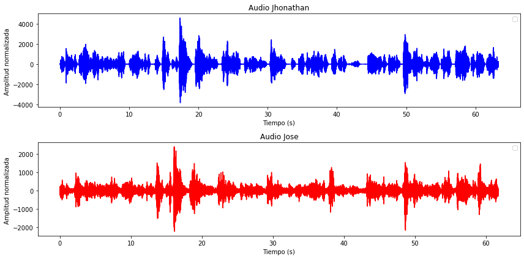
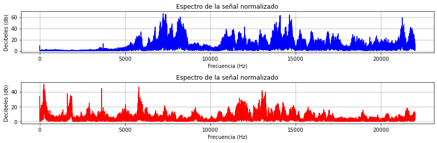

# Laboratorio 3 Señales
Este informe tiene como objetivo aplicar el análisis en frecuencia de señales de voz en un problema de captura
de señales mezcladas.

Para esto necesitamos entender una serie de terminos para la comprensión de las graficas presentadas y el codigo.

## Terminos a tener en cuenta

### Espectro del sonido 
El espectro del sonido se refiere a la distribución de la energía sonora en función de la frecuencia. Es decir, una representación gráfica que muestra la intensidad del sonido en diferentes frecuencias.
Además el espectro del sonido es una función que describe la distribución de la energía sonora en función de la frecuencia, usualmente medida en hercios (Hz).

El espectro del sonido se puede analizar utilizando la transformada de Fourier discreta. La TFD se utiliza para obtener el espectro del sonido en el dominio de la frecuencia.

    X[k] = ∑[n=0 a N-1] x[n] * e^{-j2πkn/N}

- X[k] es el espectro del sonido en la frecuencia k
- x[n] es la señal de audio en el tiempo n
- N es el número de muestras de la señal de audio
- k es la frecuencia (de 0 a N-1)
- j es la unidad imaginaria

### Decibeles 
Un decibelio (dB) es una unidad de medida logarítmica que se utiliza para expresar la relación entre la amplitud de una señal y una referencia. La relación se expresa en términos de la razón entre la potencia de la señal y la potencia de referencia, se define como.

    dB = 10 * log10(P/P0)

- P es la potencia de la señal
- P0 es la potencia de referencia

Los decibelios se utilizan para medir la intensidad de la señal en relación con una referencia. Esto es útil para comparar la intensidad de diferentes señales, además tambien se utilizan para analizar la relación entre la señal deseada y el ruido presente en la señal. Esto es útil para evaluar la calidad de la señal.

## Librerias y audios
En primer lugar se importaron las librerias scipy para leer y guardar los audios .wv, en segundo lugar se importo la funcion matematica como libreria numpy, luego la funcion que nos permite graficar todo como matplotlib y por ultimo la descomposicion del audio mejor conocido como ICA

        import scipy.io.wavfile as wav
        import numpy as np
        import matplotlib.pyplot as plt
        from sklearn.decomposition import FastICA

La ruta de los audio se dara mediante el directorio dle computador que se desea guardar en mi caso como "C:/Users/DELL/Desktop/universidad/python/Señales/laboratorio-3-PDS/audios_mejorados/"

        # Ruta de los audios
        ruta_audios = "audios/"
        output_dir = "C:/Users/DELL/Desktop/universidad/python/Señales/laboratorio-3-PDS/audios_mejorados/"

Ahora se van a cargar los audios, esto gracias a la libreria wav donde el audio se dara mediante ruta_audios mas audio_Jhonathan.wav y lo mismo con audio_Jose.wav

        # Cargar audios
        time_Jhonathan, audio_Jhonathan = wav.read(ruta_audios + "audio_Jhonathan.wav")
        time_Jose, audio_Jose = wav.read(ruta_audios + "audio_Jose.wav")

La frecuencia de muestreo dado en los microfonos es de 44KHz, el tiempo sera igual a la cantidad de datos entre la frecuencia de muestreo.

        fs = 44000 # 44KHz
        time_demora_Jhonathan = len(audio_Jhonathan) / fs
        time_demora_Jose = len(audio_Jose) / fs

Se va a imprimir el tiempo de duracion de los audios:

        print(f"Tiempo de la duracion del audio de Jhonathan: {time_demora_Jhonathan:.3f} s")
        print(f"Tiempo de la duracion del audio de Jose: {time_demora_Jose:.3f} s")

Tiempo de la duracion del audio de Jhonathan: 63.279 s
Tiempo de la duracion del audio de Jose: 61.720 s

Ahora vamos a manejar una escala para los audios esto debido a su amplitud y se pueda visualizar mejor para ello escogimos 10, donde se dara el parametro a ambas señales.

        Escala = 10
        Jhonathan = audio_Jhonathan[:: Escala]
        Jose = audio_Jose[:: Escala]
        tiempo_Jhonathan = np.linspace(0, time_demora_Jhonathan, len(Jhonathan))
        tiempo_Jose = np.linspace(0, time_demora_Jose, len(Jose))

Por ultimo se van a grtaficar ambas señales esto con una amplitud normalizada en y y en x el tiempo en este caso el minuto que se dio y por ultimo se caragar y se vera de la siguiente manera:

        plt.figure(figsize=(12,6))
        plt.subplot(2, 1, 1)
        plt.plot(tiempo_Jhonathan, Jhonathan, color="blue")
        plt.xlabel("Tiempo (s)")
        plt.ylabel("Amplitud normalizada ")
        plt.title("Audio Jhonathan")
        plt.legend()

        plt.subplot(2, 1, 2)
        plt.plot(tiempo_Jose, Jose, color="red")
        plt.xlabel("Tiempo (s)")
        plt.ylabel("Amplitud normalizada ")
        plt.title("Audio Jose")
        plt.legend()

        plt.tight_layout()
        plt.show()

Esta gráfica de nivel de audio nos  muestra la variación de la amplitud del audio en función del tiempo. Se puede ver una magnitud como amplitud del audio esto en Y, y en X se dara su tiempo de demora.  

En esta grafica se puede evidenciar momentos en los que la amplitud del audio es más alta los picos pueden indicar momentos de mayor intensidad en la en la voz, momentos en los que la amplitud del audio es más baja.

## ESPECTRO POR MEDIO DE LA TRANSFORMADA DE FOURIER HACIA LOS AUDIOS
En primer lugar debemos comprender que los audios grabados no son de muy buena calidad debido a que se grabaron a una distancia de 6.096 m con una incertidumbre de 0.001 m debido a que fue medido en cm y ya en su conversion a metros mantiene en cierta manera la misma incertidumbre

Ahora bien para ello debemos tener en cuenta que paea ka separacion de audios, comprendemos que existe un ruido en el ambiente o en el medio, bien sea el aire, gritos, que otra persona grito, etc esto hace que debamos averiguar cual es la relacion entre el ruido del ambiente y el audio, esto se calculara con el SNR dicho bien este SNR se dara mediante la siguiente funcion calcular el snr mediante el audio de entrada.

Esta funcion se llamara "calculate_snr" en donde en dicha funcion entra un audio bien sea el de Jose o el de Jhonathan, para ello primero deberemos calcular el poder de audio esto se dara medianto la funcion np.mean del audio original al cuadrado, ya luego el ruido de poder sera mediante el audio menos literal el audio de poder, ahora ya con esto tendremos el ruido mediante la señal original dicha señal se dara y se restara, por ultimo el SNR sera igual a 10 por el logaritmo en base 10 de la division entre el audio de poder entre el ruidpo y por ultimo retornara el ruido generado:

        def calculate_snr(audio):
            audio_power = np.mean(audio ** 2)
            noise_power = np.var(audio - np.mean(audio)) 
            snr = 10 * np.log10(audio_power / noise_power)
            return snr

Ahora bien vamos a llamar a la funcion y con ello enviaremos los datos con el fin de solucionar dicho inconveniente ahora bien, enviamos los audios hacia la funcion:

        snr_jhonathan = calculate_snr(Jhonathan)
        snr_jose = calculate_snr(Jose)

Luego de ello imprimimos el valor dicho valor fue:

        print(f"SNR de Jhonathan: {snr_jhonathan:.2f} dB")
        print(f"SNR de José: {snr_jose:.2f} dB")

SNR de Jhonathan: -15.44 dB
SNR de José: -7.93 dB

Dicho resultado indica que el ruido del entorno es mayor a comparacion del audio original y la señal original, con ello entre mas negativo es menos se entienete e indica que la poblacion no estuvo muy bien advertida con este tipo de cosas.

Ya sabiendo que el SNR es menor e indica una gran complicacion, pero es totalmente normal porque el ruido del entorno sera mas fuerte que el de los audio originales, entre mas negativo mas normal sera el audio porque rara vez supera a el ruido ambiente

Ahora bien debemos tener en cuenta para poder graficar lo dado con la trsnsformada de Fourier con el fin de ver la magnitud y con ello poder observar la frecuencia en el cual esta dando la señal se dara mediante lo siguiente:

En primer lugar vamos a calcular t como el tiempo, esto con el fin de hacer el cambio a la frecuencia esto como 0, 1 y fs siendo esta de 44KHz esto dado por el tipo de audio de cierta calidad que se dio, ya con este se almacena en un vector de tiempo y N sera igual a la cantidad de datos en el tiempo

        t = np.linspace(0, 1, fs, endpoint=False)  # Vector de tiempo
        N = len(t)

Ahora en cuanto a las frecuencias debemos tener en cuenta que se hara medianto la funcion fft y frecuencia esto con N dado el vector tiempo, 1/ fs osea 1 entre 44KHz, luego de ello el espectro sera igual a la señal original entre la cantdiad de datos en el tiempo, en cuanto a ela magnitud sera lo mismo que decir el espectro al cuadradi entre los numeros de datos en el tiempo esto se aplicara para ambas señales.

        frequencies = np.fft.fftfreq(N, 1/fs)
        spectrum_Jhonathan = np.fft.fft(Jhonathan) / N
        magnitude_Jhonathan = 2 * np.abs(spectrum_Jhonathan[:N//2])
        spectrum_Jose = np.fft.fft(Jose) / N
        magnitude_Jose = 2 * np.abs(spectrum_Jose[:N//2])

Ahora con ello vamos a graficar la transformada de Fourier en cuanto o en base a lo dado anteriormente esto con la funcion plt esto en x la HZ osea frecuencia y en Y la magnitud osea los decibeles esto como se vera en la siguiente grafica:

        plt.figure(figsize=(12,4))
        plt.subplot(2, 1, 1)
        plt.plot(frequencies[:N//2], magnitude_Jhonathan, 'blue')
        plt.xlabel('Frecuencia (Hz)')
        plt.ylabel('Decibeles (db)')
        plt.title('Espectro de la señal normalizado')
        plt.grid()

        plt.subplot(2, 1, 2)
        plt.plot(frequencies[:N//2], magnitude_Jose, 'red')
        plt.xlabel('Frecuencia (Hz)')
        plt.ylabel('Decibeles (db)')
        plt.title('Espectro de la señal normalizado')
        plt.grid()

        plt.tight_layout()
        plt.show()

Ahora bien aca se puede observar los audios en un dominio de la frecuencia y dado mediante los decibeles esto como su magnitud principal esto con el fin de comprender que dicha grafica recreara nuevamente la señal original esto a traves de lo analogo.

## SEPARACION DE AUDIOS METODO ICA Y BEAMFORMED

### METODO ICA
Ahora bien para esto en primer lugar debemos poder separar las voces a traves de dos metodos el primero a utilizar sera el metodo ICA este metodo es muy utilizado debido a su gran efectividad con la libreria sklearn.decomposition dicha liberaria se hara cargo de la separacion del audio y el mejoramiento del audio por medio de ICA.

ICA (Análisis de Componentes Independientes) es una técnica de procesamiento de señales utilizada para separar señales superpuestas en componentes estadísticamente independientes. Es especialmente útil en problemas como la separación de fuentes de audio, donde múltiples señales se mezclan y es necesario extraer cada una por separado. 

Ahora bien con ello debemos primero almacenar la cantidad de tiempo de los audios esto por medio de la funcion min y seleccionamos que señal vamos a guardar en cuanto a los minutos en donde sera audio_Jhonathan y la cantidad de datos de audio_Jose esto buscando un promedio luego de esto el nuevo audio tendra una duracion de los minutos anteriormente calculados y con ello vamos a traves de ICA a separar los audios esto con una transformada hacia los audios mixtos, que tendran ambas voces este separara los audios, luego de ello va a guardar el valos esto en un vector y sera como audios separados por el pico maximo dado de los audios por una constante esta entre mas grande sea la amplitud va a aumentar y entre mas pequeña va a disminuir como los audios se escuchan muy bajos, la amplitud la aumentamos y el valos que escogimos fue 62767

        # Separación con ICA
        minutos = min(len(audio_Jhonathan), len(audio_Jose))
        nuevo_audio_Jhonathan = audio_Jhonathan[:minutos]
        nuevo_audio_Jose = audio_Jose[:minutos]
        audios_mixtos = np.column_stack((nuevo_audio_Jhonathan, nuevo_audio_Jose))
        ica = FastICA(n_components=2)
        audios_separados = ica.fit_transform(audios_mixtos)
        audios_separados = np.int16(audios_separados / np.max(np.abs(audios_separados)) * 62767)

El principio detrás de ICA es que una señal mixta (como dos personas hablando al mismo tiempo en un micrófono) se puede representar como una combinación lineal de fuentes independientes. ICA intenta encontrar una transformación que recupere estas fuentes originales basándose en la suposición de que son estadísticamente independientes entre sí.

Ahora para poder guardar los audios lo haremos mediante la libreria wav el cual nos permitira guardar el audio dado por ICA esto como audios separados pero esto como la voz 1 en este caso se definira 0, como la voz Jhonathan y 1 como la voz Jose y con ello tendremos unos audios con mayor amplitud y separados.

        wav.write(output_dir + "Audio_ICA_Jhonathan.wav", fs, audios_separados[:, 0])
        wav.write(output_dir + "Audio_ICA_Jose.wav", fs, audios_separados[:, 1])

Por ultimo informa que si todo salio bien las señales filtradas con ICA se han guardado

        print("Se guardaron las señales filtradas con ICA")

### METODO Beamforming

El Beamforming (formación de haces) es una técnica utilizada en procesamiento de señales y telecomunicaciones para mejorar la direccionalidad de señales captadas por múltiples sensores (como micrófonos o antenas). A diferencia de ICA, que separa señales basándose en independencia estadística, Beamforming utiliza la información espacial (posición de los micrófonos y direcciones de llegada del sonido) para mejorar la captura de una señal específica y suprimir interferencias.

Esto indica que se basara en el espacio entre ambos microfonos osea en nuestro caso ambos microfonos estaban alejados a 18 pies al rededor de 6.096 m donde dicha distancia sera muy importante ya que este metodo usara las ondas espaciales para la separacion de audios

En primer lugar se realizo una funcion llamada delay_and_sum donde se pusieron el audio de las señales y un delays, esto dado en la funcion, ya con esto audio segnal sera igual a un array entre los audios con un intermedio de constante que dejara en claro el tipo de valor en este caso 32, y un for hacia audio signal la cantidad de minutos igual que en ICA, luego audio dignal sera lo mismo que decir audio signal pero limitado por la cantidad de minutos, ahora se hara un delay para encontrar el espacio dado, con ello se podra hacer un modo de contante y con ello aumentar o disminuir la amplitud hacia el espacio y con este se hara hacia un blucle en el audio, por ultimo retorne delayed_signal que fue lo anteriormente calculado

        # Implementación de Beamforming (Delay-and-Sum)
        def delay_and_sum(audio_signals, delays):
            audio_signals = [np.array(audio, dtype=np.float32).flatten() for audio in audio_signals]
            min_length = min(map(len, audio_signals))
            audio_signals = [audio[:min_length] for audio in audio_signals]
            max_delay = max(delays)
            delayed_signals = [
                np.pad(audio, (delay, max_delay - delay), mode='constant')[:min_length]
                for audio, delay in zip(audio_signals, delays)
            ]
            return np.mean(delayed_signals, axis=0)

Ahora como se hablaba que ers en el espacio vamos a ajustar el delay segun la posicion de lso microfonos el primer microfono estaba a 0 pies y el segundo a 18 pies, ya con esto se llamara la funcion y se dara la señal del audio original y con este separara los audios lo mismo que con el audio de jose.

        # Simulación de retardos para Beamforming (en muestras)
        delays = [0, 18]  # Ajusta según la posición de los micrófonos
        beamformed_Jhonathan = delay_and_sum([audio_Jhonathan, audio_Jose], delays)
        beamformed_Jose = delay_and_sum([audio_Jose, audio_Jhonathan], delays)

Dado esto se cuadrara la amplitud y se hara como un beaforming del audio como wav esto a traves de la misma constante anteriormente dicha para la amplitud en ICA

        beamformed_Jhonathan = np.int16(beamformed_Jhonathan / np.max(np.abs(beamformed_Jhonathan)) * 62767)
        beamformed_Jose = np.int16(beamformed_Jose / np.max(np.abs(beamformed_Jose)) * 62767)

        # Guardar los audios procesados con Beamforming
        wav.write(output_dir + "Audio_Beamforming_Jhonathan.wav", fs, beamformed_Jhonathan)
        wav.write(output_dir + "Audio_Beamforming_Jose.wav", fs, beamformed_Jose)

Por ultimo si todo esta bien dira se guardaron las señales filtradas con Beamforming

        print("Se guardaron las señales filtradas con Beamforming")

### ¿ICA O BEAFORMING?

Ambos métodos tienen sus ventajas y desventajas, dependiendo del contexto en el que se utilicen.

ICA (Análisis de Componentes Independientes) se basa en la independencia estadística de las señales para separar las fuentes de audio. Es altamente efectivo en entornos donde las señales de interés tienen características estadísticas diferentes. Además, su implementación en Python con sklearn.decomposition.FastICA es sencilla y no requiere información previa sobre la ubicación de los micrófonos. En este experimento, ICA demostró ser más eficiente para separar las voces y mejorar la calidad del audio.

Beamforming (Formación de haces) utiliza la información espacial de los micrófonos para mejorar la captura de una señal específica y reducir interferencias. Sin embargo, su rendimiento depende de la disposición física de los micrófonos y de la precisión en la estimación de los retardos. En nuestro caso, aunque Beamforming permitió cierta mejora en la direccionalidad del audio, no logró separar las señales con la misma eficacia que ICA.

Conclusión: En este experimento, ICA mostró un mejor desempeño en la separación y mejora de los audios. Su facilidad de implementación y efectividad en la recuperación de las señales lo convierten en la opción preferida sobre Beamforming, especialmente en escenarios donde no se cuenta con un arreglo bien definido de micrófonos o cuando se busca una separación más clara de las voces.

## Requisitos
- Python 3.11
- Wfdb
- matplotlib
- Grabadora de audio
- Espacio preferiblemente libre de ruido

## Bibliografia 
- Smith, J. O. (2010). Procesamiento de señales de audio
- Renza, D., & Ballesteros, D. M. (2020). Procesamiento digital de señales utilizando Python
- GitHub. (2020). Deep Learning for Audio Signal Processing.

## Contacto
- Jose Daniel Porras est.jose.dporras@unimilitar.edu.co
- Jhonathan David Guevara Ramirez est.jhonathan.guev@unimilitar.edu.co